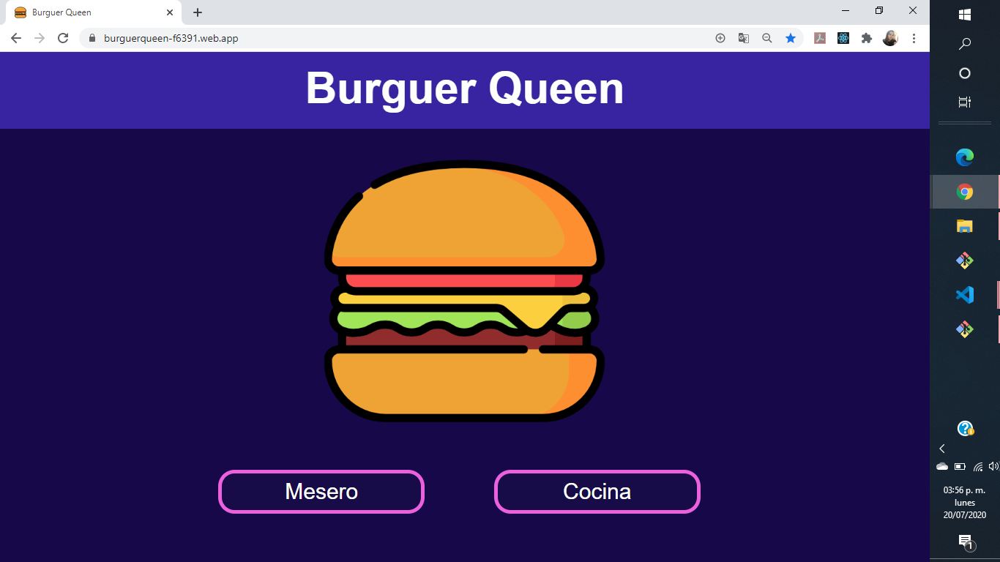
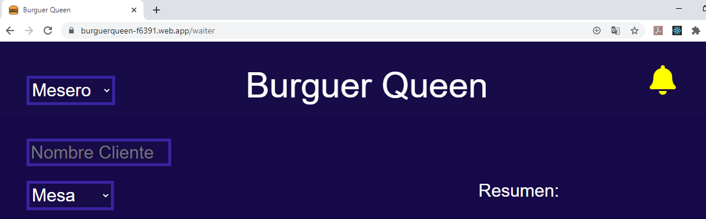
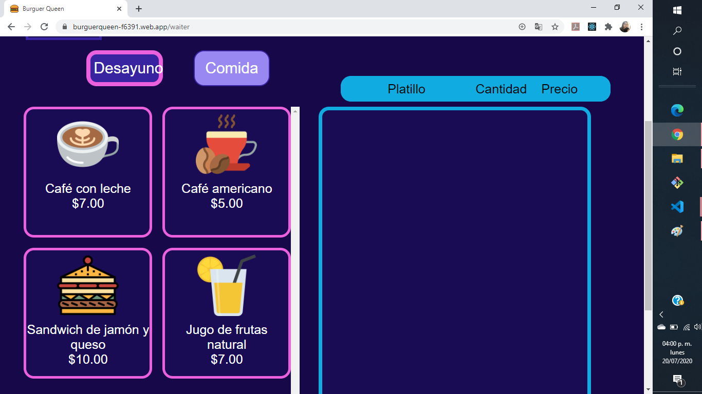
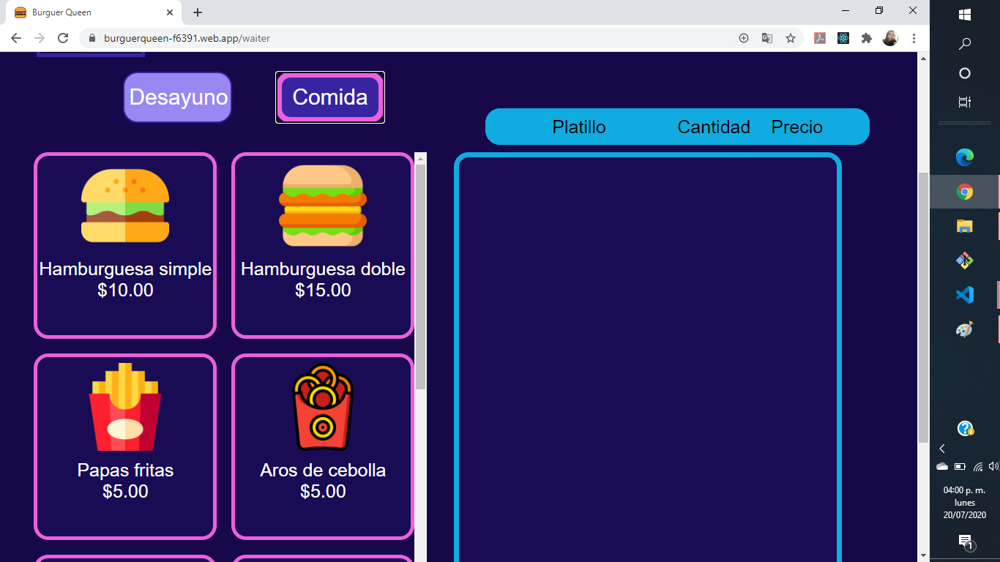
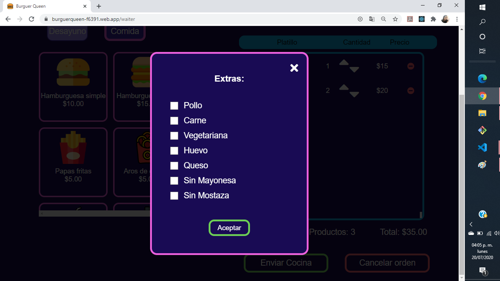
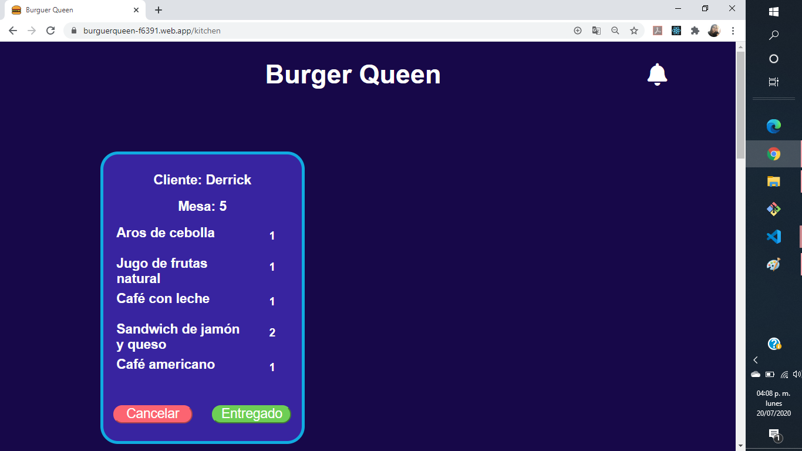
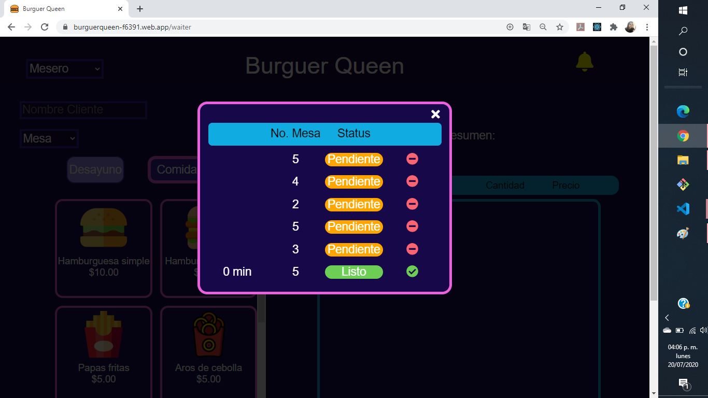

# Burger Queen

# Preambulo

Proyecto realizado con el Framework React, para un restaurante  esta divido  para dos perfiles 

El perfil de mesero, se encuentra 
en dos menus: 

Desayuno

Comidas

Al seleccinar el platillo, se puede agregar algunoos aditamnetos y la cantidad requerida.

En el perfil de cocina, se visualiza el listado de las ordenes y puede entregar o cancelar.

Tambien se viusaliza el listado de las ordenes en una modal. Ya sean pendientes o que ya estan lista para los clientes y tambien se pueden quietar del listado 

### HTML y CSS

- [x] HTML semántico
- [x] CSS flexbox
- [x] Sass
- [x] Maquetación

### Frontend Development

- [x] Componentes
- [x] Manejo del estado

### PWA

- [x] Concepto
- [x] Utilidad
- [x] Que es [Workbox](https://developers.google.com/web/tools/workbox)
- [x] Qué es un `serviceWorker`

### React

- [x] [`JSX`](https://es.reactjs.org/docs/introducing-jsx.html)
- [x] [Componentes `class` y componentes `function`](https://es.reactjs.org/docs/components-and-props.html#function-and-class-components)
- [x] `props`
- [x] [Manejo de eventos](https://es.reactjs.org/docs/handling-events.html)
- [x] [Listas y keys](https://es.reactjs.org/docs/lists-and-keys.html)
- [x] [Renderizado condicional](https://es.reactjs.org/docs/conditional-rendering.html)
- [x] [Levantamiento de estados](https://es.reactjs.org/docs/lifting-state-up.html)
- [x] [`hooks`](https://es.reactjs.org/docs/hooks-intro.html)
- [x] [`CSS` modules](https://create-react-app.dev/docs/adding-a-css-modules-stylesheet)
- [x] [React Router](https://reacttraining.com/react-router/web)

### Firebase

- [x] Firestore
- [x] Firebase security rules
- [x] Observables

### Testing

- [x] Testeo de tus interfaces
- [x] Testeo de componentes
- [ ] Testeo asíncrono
- [ ] Mocking

### Colaboración en Github

- [x] Branches
- [x] Pull Requests
- [ ] Tags

### Organización en Github

- [x] Projects
- [ ] Issues
- [ ] Labels
- [ ] Milestones

### Buenas prácticas de desarrollo

- [x] Modularización
- [x] Nomenclatura / Semántica
- [ ] Linting

---
